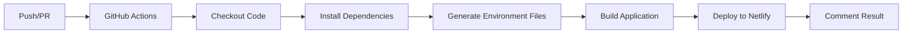

# 🚀 Guía de Configuración: GitHub Actions para Netlify

Esta guía explica cómo configurar GitHub Actions para desplegar automáticamente la aplicación GestPharma a Netlify.

## 📋 Tabla de Contenidos

1. [¿Qué hace esta configuración?](#qué-hace-esta-configuración)
2. [Requisitos Previos](#requisitos-previos)
3. [Configuración de Secrets en GitHub](#configuración-de-secrets-en-github)
4. [Workflows Disponibles](#workflows-disponibles)
5. [Cómo Funciona](#cómo-funciona)
6. [Troubleshooting](#troubleshooting)

## 🎯 ¿Qué hace esta configuración?

Este proyecto incluye dos workflows de GitHub Actions:

1. **Producción** (`netlify-production.yml`): Despliega automáticamente a Netlify cuando haces push a la rama `main`
2. **Preview** (`netlify-preview.yml`): Crea un despliegue de preview para cada Pull Request

Ambos workflows:
- ✅ Instalan dependencias
- ✅ Generan archivos de entorno desde secrets
- ✅ Construyen la aplicación Angular/Ionic
- ✅ Despliegan a Netlify
- ✅ Publican el resultado en comentarios (preview) o commits (producción)

## 📋 Requisitos Previos

### 1. Cuenta de Netlify

Si aún no tienes una cuenta:
1. Ve a [Netlify](https://app.netlify.com/signup)
2. Regístrate con GitHub (recomendado)
3. Crea un nuevo sitio:
   - Click en "Add new site" → "Import an existing project"
   - Conecta tu repositorio
   - **NO configures build settings** (GitHub Actions se encargará)

### 2. Obtener Netlify Tokens

#### NETLIFY_AUTH_TOKEN
1. Ve a [Netlify User Settings → Applications](https://app.netlify.com/user/applications)
2. En la sección "Personal access tokens", click en "New access token"
3. Dale un nombre descriptivo: `GitHub Actions - GestPharma`
4. Copia el token generado (solo se muestra una vez)

#### NETLIFY_SITE_ID
1. Ve a tu sitio en Netlify
2. Click en "Site settings"
3. En la sección "Site information", copia el "Site ID"
4. Ejemplo: `1234abcd-5678-90ef-ghij-klmnopqrstuv`

### 3. Credenciales de Firebase

Ya debes tener estas credenciales de tu proyecto Firebase. Si no las tienes:
1. Ve a [Firebase Console](https://console.firebase.google.com/)
2. Selecciona tu proyecto
3. Ve a Project Settings → General
4. En "Your apps" → SDK setup and configuration, copia los valores

## 🔐 Configuración de Secrets en GitHub

### Paso 1: Acceder a la configuración de Secrets

1. Ve a tu repositorio en GitHub
2. Click en **Settings** (Configuración)
3. En el menú lateral, busca **Secrets and variables** → **Actions**
4. Click en **New repository secret**

### Paso 2: Agregar los Secrets

Debes agregar los siguientes secrets uno por uno:

#### 🌐 Netlify (Requeridos)

| Secret Name | Descripción | Ejemplo |
|------------|-------------|---------|
| `NETLIFY_AUTH_TOKEN` | Token de autenticación personal de Netlify | `nfp_abcd1234...` |
| `NETLIFY_SITE_ID` | ID único del sitio en Netlify | `1234abcd-5678-90ef...` |

#### 🔥 Firebase (Requeridos)

| Secret Name | Descripción | Ejemplo |
|------------|-------------|---------|
| `FIREBASE_API_KEY` | API Key de Firebase | `AIzaSyAxiaUFUaLBwD...` |
| `FIREBASE_AUTH_DOMAIN` | Dominio de autenticación | `auth-app-cff73.firebaseapp.com` |
| `FIREBASE_PROJECT_ID` | ID del proyecto Firebase | `auth-app-cff73` |
| `FIREBASE_STORAGE_BUCKET` | Bucket de storage | `auth-app-cff73.firebasestorage.app` |
| `FIREBASE_MESSAGING_SENDER_ID` | ID del sender de mensajería | `310871799777` |
| `FIREBASE_APP_ID` | ID de la aplicación web | `1:310871799777:web:...` |

### Paso 3: Verificar los Secrets

Una vez agregados todos los secrets:
1. En la página de "Actions secrets", deberías ver los 8 secrets listados
2. No podrás ver los valores (por seguridad), solo los nombres
3. Puedes editar o eliminar secrets si es necesario

## 🔄 Workflows Disponibles

### 1. Despliegue a Producción

**Archivo:** `.github/workflows/netlify-production.yml`

**Trigger:** Push a la rama `main`

**Pasos:**
1. Checkout del código
2. Setup de Node.js 20
3. Instalación de dependencias con `npm ci`
4. Generación de archivos environment desde secrets
5. Build de la aplicación en modo producción
6. Despliegue a Netlify (producción)
7. Comentario en el commit con URL del despliegue

**Uso:**
```bash
git add .
git commit -m "feat: nueva funcionalidad"
git push origin main
```

### 2. Preview de Pull Request

**Archivo:** `.github/workflows/netlify-preview.yml`

**Trigger:** Apertura, actualización o reapertura de Pull Request

**Pasos:**
1. Checkout del código
2. Setup de Node.js 20
3. Instalación de dependencias con `npm ci`
4. Generación de archivos environment desde secrets
5. Build de la aplicación en modo producción
6. Despliegue a Netlify (preview)
7. Comentario en el PR con URL del preview

**Uso:**
```bash
# Crear una rama nueva
git checkout -b feature/mi-nueva-funcionalidad

# Hacer cambios y commit
git add .
git commit -m "feat: implementar nueva funcionalidad"
git push origin feature/mi-nueva-funcionalidad

# Crear Pull Request en GitHub
# El workflow se ejecutará automáticamente
```

## 🔍 Cómo Funciona

### Flujo de Despliegue



### Generación de Environment Files

El script `scripts/generate-env.sh` crea dos archivos:

1. **`src/environments/environment.ts`** (desarrollo):
   - URL de API local
   - Credenciales Firebase de los secrets

2. **`src/environments/environment.prod.ts`** (producción):
   - URL de API en producción (Railway)
   - Credenciales Firebase de los secrets
   - Configuración optimizada

### Proceso de Build

El comando de build es:
```bash
npm run build -- --configuration production
```

Esto:
- Usa Angular CLI para compilar la aplicación
- Aplica optimizaciones de producción (AOT, minificación, etc.)
- Genera la carpeta `www/` con los archivos estáticos
- Esta carpeta es desplegada a Netlify

## 📊 Monitoreo del Despliegue

### Ver el progreso en tiempo real

1. Ve a tu repositorio en GitHub
2. Click en la pestaña **Actions**
3. Verás una lista de workflows en ejecución
4. Click en un workflow para ver los detalles
5. Expande cada step para ver los logs

### Estados posibles

- 🟡 **In progress**: El workflow está en ejecución
- ✅ **Success**: Despliegue exitoso
- ❌ **Failed**: Error en el despliegue (ver logs)
- ⏸️ **Cancelled**: Workflow cancelado manualmente

### Notificaciones

GitHub te notificará automáticamente:
- Por email si un workflow falla
- En la interfaz de GitHub
- En tu repositorio móvil (si usas la app)

## 🛠️ Troubleshooting

### Error: "Secret not found"

**Problema:** El workflow no puede encontrar un secret.

**Solución:**
1. Ve a Settings → Secrets and variables → Actions
2. Verifica que todos los secrets estén configurados
3. Los nombres deben coincidir exactamente (case-sensitive)
4. Si editaste un secret, el workflow debe reiniciarse

### Error: "Netlify deploy failed"

**Problema:** La autenticación con Netlify falló.

**Solución:**
1. Verifica que `NETLIFY_AUTH_TOKEN` sea válido
2. Genera un nuevo token si es necesario
3. Verifica que `NETLIFY_SITE_ID` sea correcto
4. Comprueba que el sitio exista en Netlify

### Error: "Build failed"

**Problema:** La compilación de Angular falló.

**Solución:**
1. Revisa los logs del step "Build application"
2. Verifica que el código compile localmente:
   ```bash
   npm run build -- --configuration production
   ```
3. Asegúrate de que no haya errores TypeScript
4. Verifica que todas las dependencias estén en `package.json`

### Error: "Firebase configuration missing"

**Problema:** Las variables de Firebase no están configuradas.

**Solución:**
1. Verifica que todos los 6 secrets de Firebase estén configurados
2. Comprueba que no haya espacios extra en los valores
3. Genera nuevas credenciales si es necesario
4. Revisa el script `scripts/generate-env.sh`

### Preview no se genera

**Problema:** El PR no tiene un preview deployment.

**Solución:**
1. Verifica que el PR esté abierto
2. Revisa los logs del workflow en la pestaña Actions
3. Asegúrate de que el branch no sea `main`
4. Verifica que no haya errores en el build

### Despliegue lento

**Problema:** El workflow tarda mucho tiempo.

**Solución:**
1. El tiempo normal es 3-5 minutos
2. Si tarda más de 10 minutos, revisa:
   - Tamaño de `node_modules` (usar `npm ci` ayuda)
   - Cache de Node.js (ya está configurado)
   - Conexión de los runners de GitHub

## 🔗 URLs de Despliegue

### Producción
- **URL principal:** `https://tu-sitio.netlify.app`
- **Dominio personalizado:** Configurable en Netlify

### Preview
- **Formato:** `https://deploy-preview-{PR_NUMBER}--tu-sitio.netlify.app`
- **Alias:** `https://pr-{PR_NUMBER}--tu-sitio.netlify.app`

## 🎯 Mejores Prácticas

### 1. Proteger la rama main
```
Settings → Branches → Branch protection rules
- Require pull request reviews before merging
- Require status checks to pass
- Include administrators
```

### 2. Revisar los previews
- Antes de hacer merge, revisa el preview deployment
- Prueba las funcionalidades nuevas
- Verifica que Firebase funcione correctamente

### 3. Monitorear los despliegues
- Revisa los logs después de cada despliegue
- Configura notificaciones de Netlify
- Usa Netlify Analytics para métricas

### 4. Actualizar secrets periódicamente
- Rota los tokens cada 6 meses
- Actualiza credenciales si hay cambios
- Documenta los cambios en el equipo

## 📚 Referencias

- [GitHub Actions Documentation](https://docs.github.com/en/actions)
- [Netlify CLI Actions](https://github.com/nwtgck/actions-netlify)
- [Netlify Deploy Documentation](https://docs.netlify.com/site-deploys/overview/)
- [Angular Build Configuration](https://angular.dev/tools/cli/build)

## 🆘 Soporte

Si tienes problemas:

1. **Revisa los logs** en GitHub Actions
2. **Consulta esta guía** de troubleshooting
3. **Abre un issue** en el repositorio con:
   - Descripción del problema
   - Logs relevantes
   - Pasos para reproducir

## ✅ Checklist de Configuración

Usa esta lista para verificar que todo está configurado:

- [ ] Cuenta de Netlify creada
- [ ] Sitio creado en Netlify
- [ ] `NETLIFY_AUTH_TOKEN` agregado a GitHub Secrets
- [ ] `NETLIFY_SITE_ID` agregado a GitHub Secrets
- [ ] Los 6 secrets de Firebase agregados
- [ ] Workflows creados en `.github/workflows/`
- [ ] Primer push a `main` realizado
- [ ] Despliegue de producción exitoso
- [ ] PR de prueba creado
- [ ] Preview deployment funciona
- [ ] URLs de despliegue verificadas

---

¡Con esta configuración, tu aplicación se desplegará automáticamente cada vez que hagas cambios! 🎉
